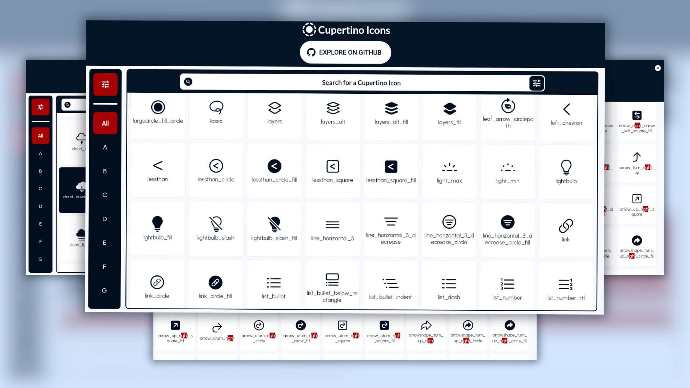

# Welcome to the Official Github Repository of The Cupertino Icons Gallery App



**[Cupertino Icons Gallery](https://cupertino.page.link/icons)** - An Open-Source Collection of over 1,335 Flutter Cupertino Icons Used and Trusted by over 8K Flutter Developers around the World with thousands monthly active users.

## Features of the Cupertino Icons Gallery App

- **Search for Icons:** Search for any Cupertino Icon by its name or by its code point.
- **Filter Icons:** Filter Icons by their Alphabetical Letters.
- **View Icon Code & Details:** View the Icon Details ready to use in your project.
- **Copy Icon Code:** Copy the Icon Code to your Clipboard for use in your Flutter Projects.

## Visit Cupertino Icons Gallery

- Watch a `Short YouTube Video` of Cupertino Icons Gallery App Here: <https://youtu.be/Aa59ucCQxhw>

- **Cross-platform Access link:** to the Cupertino Icons Gallery App. [**https://cupertino.page.link/icons**](https://cupertino.page.link/icons)

- On the **Web:** [**https://cupertino-icons.web.app/**](https://cupertino-icons.web.app/)

- On **Google Play Store:** [**https://play.google.com/store/apps/details?id=com.capps096apps.cupertino_icons_gallery**](https://play.google.com/store/apps/details?id=com.capps096apps.cupertino_icons_gallery)

## To Contribute to & Run the Cupertino Icons Gallery Repository

### a) Install Flutter

Cupertino Icons Gallery is built using [The Flutter Framework](https://flutter.dev/) `version 3.22.2` and therefore to run it on your machine you need to have Flutter installed.

If you're new to Flutter the first thing you'll need is to follow the [setup instructions](https://flutter.dev/docs/get-started/install). `Once you're set up and can compile the sample Flutter app, you're ready to run Cupertino Icons Gallery!`

### b) Clone the Cupertino Icons Gallery Repository

- Clone it from the [Cupertino Icons Gallery Github Repository](https://github.com/capps096github/cupertino_icons_gallery) using:

1. The [Github Desktop App](https://desktop.github.com/)
2. Your favourite Terminal by running the following command:

``` bash
   git clone https://github.com/capps096github/cupertino_icons_gallery.git
   ```

### c) Open the Cupertino Icons Gallery Repository Folder

Using your IDE of choice, open the `cupertino_icons_gallery` directory that contains the codebase of the app.

Then, using the Terminal inside your IDE, run `flutter pub get` to get the dependencies required to run the app.

### d) Now run the Cupertino Icons Gallery App

- In the same terminal type `flutter run` to build and deploy the app to your connected device or simulator.

- If you would like to try Cupertino Icons Gallery using Flutter for web, you can use `flutter run -d chrome` or `flutter run -d edge`.

- Enjoy!

> **e) Disclaimer**:
>
> - Cupertino Icons Gallery is Cross-Platform but however `it has only been fully tested` on `Android`, `Windows` and `The Web`.
> - Therefore `we recommend that you run it on Android, Windows or The Web` only to avoid any bugs that may occur as a result of running it on the other platforms that we haven't tested yet.
> - We also recommend using the following IDE’s `Android Studio`, `Visual Studio Code` and `IntelliJ` while running the application since those are the ones we used during our production process.

## Credits

The Cupertino Icons Gallery was initially developed by [Mugisa Brian Cephas](https://twitter.com/xephas_official), join him on X (_formerly Twitter_) [@xephas_official](https://twitter.com/xephas_official)

## Give it a Try, Visit the [Cupertino Icons Gallery](https://cupertino-icons.web.app)


